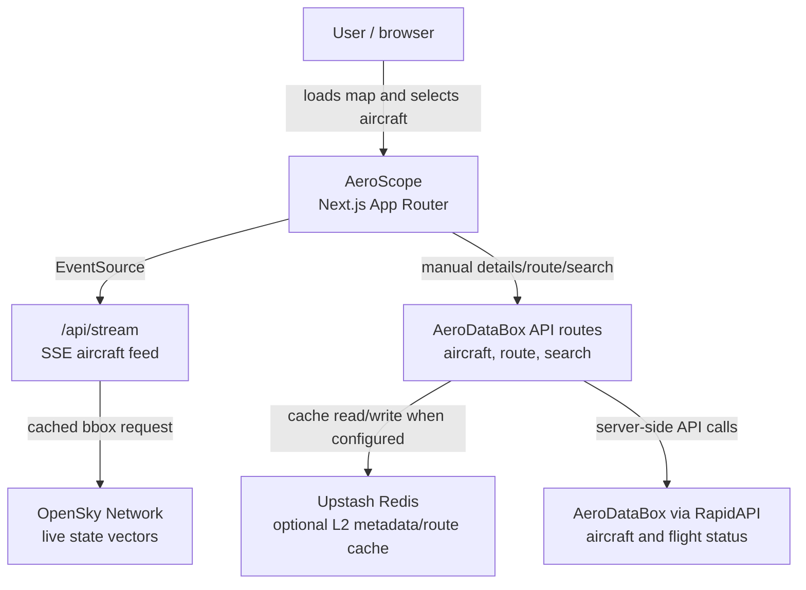

# Architecture

## Overview

AeroScope is a single Next.js application with a browser map UI and a small Node.js API layer. The core architectural choice is to keep expensive or quota-limited upstream calls behind server-side fan-out and manual user actions:

- OpenSky live positions are fetched by a singleton server process and streamed to all browser clients.
- AeroDataBox enrichment is only requested after explicit user action or search submit.
- Client-side UI state keeps map interactions responsive while server routes protect API keys and caching behavior.

## System Context

## Runtime Flow

1. `app/page.tsx` renders `MapShell`, which mounts the dynamic client map, status bar, search box, stream subscriber, and aircraft panel.
2. `FlightMap` publishes the current map bounding box to Zustand after map load and `moveend`.
3. `FlightStream` opens an EventSource connection to `/api/stream` with the current bounding box.
4. `/api/stream` subscribes to `streamHub`, which either reuses recent OpenSky data or fetches a fresh union bounding box.
5. The browser receives `states` events and updates the shared aircraft list.
6. Selecting an aircraft updates `selectedIcao24`.
7. Clicking `Load details and route` runs manual TanStack Query fetches against AeroDataBox proxy routes.
8. Successful route lookup updates `selectedRoute`, which drives both the side-panel progress widget and the map route overlay.

## Domain Model

| Entity | Source | Notes |
| --- | --- | --- |
| `Aircraft` | OpenSky | Current position, callsign, ICAO24, altitude, velocity, heading, squawk |
| `AircraftMetadata` | AeroDataBox | Registration, model, airline, image, production line |
| `FlightRoute` | AeroDataBox Flight Status | Flight number, callsign, departure/arrival airports, timing, terminals, distance |
| `BBox` | MapLibre viewport | Server-side OpenSky request boundary |

## Key Components

| Component | Responsibility |
| --- | --- |
| `components/FlightMap.tsx` | Initializes MapLibre, renders deck.gl aircraft and route layers, map-style switcher, altitude legend |
| `components/FlightStream.tsx` | Opens SSE connection, parses `states` and `error` events, updates stream status |
| `components/AircraftPanel.tsx` | Shows selected aircraft live fields, route widget, metadata, and manual AeroDataBox loading |
| `components/SearchBar.tsx` | Searches visible aircraft locally; falls back to manual AeroDataBox route search |
| `lib/stream-hub.ts` | Owns OpenSky polling cadence, cache, fan-out, and rate-limit backoff |
| `lib/aerodatabox.ts` | Owns AeroDataBox request mapping and L1/L2 cache policy |
| `lib/store.ts` | Zustand store for aircraft list, selected aircraft/route, bbox, and connection status |

## State, Cache, and Persistence

| Layer | Data | TTL / behavior |
| --- | --- | --- |
| `streamHub.lastPayload` | OpenSky aircraft list | 5 minutes |
| `streamHub` rate-limit backoff | OpenSky rate-limit state | 15 minutes after `Too many requests` |
| Browser `localStorage` | Aircraft metadata | 30 days, only stores useful metadata |
| Browser `localStorage` | Flight route | 12 hours |
| TanStack Query | Manual metadata/route state | 24 days for metadata query cache, 12 hours for route query cache |
| Server L1 `Map` | AeroDataBox metadata | 24 hours |
| Server L1 `Map` | AeroDataBox routes/searches | 12 hours |
| Upstash Redis | Optional AeroDataBox metadata | 30 days |
| Upstash Redis | Optional AeroDataBox route/search | 12 hours |
| HTTP `Cache-Control` | Metadata route | 30 days plus 1 day stale-while-revalidate |
| HTTP `Cache-Control` | Route/search routes | 12 hours plus 1 hour stale-while-revalidate |

There is no database. Redis is optional and used only as a shared cache.

## Error Handling and Degradation

- OpenSky rate limits are surfaced as `OpenSky limited`, not a generic connection failure.
- If cached OpenSky data exists during a rate-limit period, the stream republishes cached aircraft instead of hammering upstream.
- AeroDataBox route and metadata failures return `502` from server routes and are shown as non-blocking panel messages.
- Missing AeroDataBox keys return empty metadata/route behavior rather than breaking the live map.
- Empty AeroDataBox browser results are not persisted, so a later valid subscription/key can recover.

## Tradeoffs

- The OpenSky cache favors quota safety over second-by-second freshness.
- Route progress uses great-circle/current-position math, not the exact filed flight path.
- AeroDataBox lookups remain manual because Basic plan requests and API units are hard-limited.
- The stream hub is process-local; multi-instance deployments need either sticky routing or a shared ingestion layer to avoid duplicate OpenSky polling per instance.
